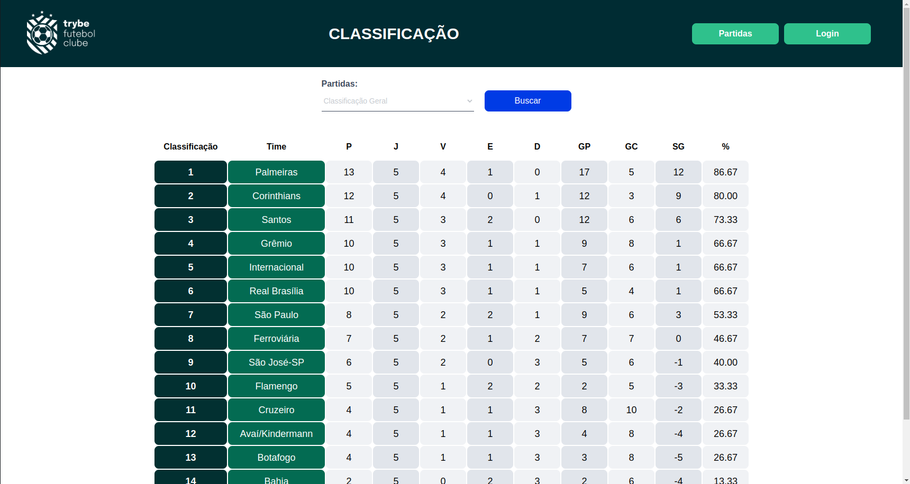

# :construction: README em construção ! :construction:
 # ***TFC - Trybe Futebol Clube***

O projeto ***TFC - Trybe Futebol Clube*** foi um projeto indivídual de propósito puramente educacional, parte do curso de desenvolvimento web da [Trybe](https://github.com/betrybe).

A proposta é que as pessoas estudantes criem uma API, em typeScript, que será consumida pelo front-end já disponibilizado pela *Trybe*, para um site informativo sobre partidas e classificações de futebol! ⚽️

A API comunica-se com um banco de dados local com informações sobre partidas fictícias. Por tanto, o objetivo deste projeto é apenas aplicar todos os conhecimentos adquiridos no curso de back-end até aquele momento. Sendo eles:
* A dockerização dos aplicativos. Criando o *Dockerfile* para as aplicações front e back end.
* A modelagem de dados com ***MySQL*** através do ***Sequelize***;
* A criação e associação de tabelas usando *models* do *sequelize*;
* A construção de uma ***API REST*** com endpoints para consumir os models criados;
* A construção de um *CRUD* com ***TypeScript***, utilizando *ORM*;
* A construção de testes de cobertura usando ***mocha***, ***chai*** e ***sinon***.

## Para rodar essa aplicação localmente:

A aplicação tem seus 3 componentes, backend, frontend e banco de dados, dockerizados.
Clone o repositório e em sua pasta raíz execute o comando `npm run compose:up` para iniciar a aplicação dockerizada.
O front-end é acessado via `localhost:3000` e o back-end via `localhost:3001`

Para rodar os testes de integração disponívies, exceute na pasta raíz os seguintes comandos para instalar as dependências e executar os testes:

```
npm install
cd app/backend && npm test
```

## Demonstração de uso:



### Endpoints:

Estes são os endpoints que podem ser acessados através das requisições de um API Client (como Insomnia ou Postman)

|Método|Funcionalidade|URL|Observações|
|------|--------------|---|-----------|
|`POST`|Efetua login de um usuário ou administrador cadastrado.|http://localhost:3001/login|Está requisição necessita de um JSON no formato: <details><summary> dsadasdsa </summary></details>|
```
{
	"email": "admin@admin.com",
	"password": "secret_admin"
}
```|